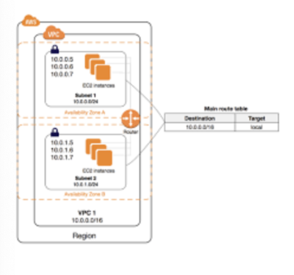

### AWS

- Amazon Web Service
- 아마존에서 제공하는 클라우드 컴퓨팅 플랫폼

### 클라우드 컴퓨팅

- 인터넷(클라우드)을 통해 서버, 스토리지, 데이터베이스, 네트워킹 등의 컴퓨팅 서비스를 제공하는 것
- IT 리소스(데이터베이스, 스토리지, 애플리케이션 등)를 인터넷을 통해 온디맨드로 제공하고 사용한 만큼만 비용을 지불하는 것
    - 온디맨드 : 주문형 서비스 → 수요(demand)에 초점을 맞춘 서비스로 요구사항에 따라 즉시 공급하는 방식, 공급이 아닌 수요가 모든 것을 결정하는 것!

### EC2 (**Elastic Compute Cloud**)

- AWS에서 제공하는 클라우드 컴퓨팅 서비스 : **AWS에서 원격으로 제어할 수 있는 가상의 컴퓨터를 한 대 빌리는 것**
- 아마존이 각 세계에 구축한 데이터 센터의 서버용 컴퓨터들의 자원을 원격으로 사용할 수 있는 것
- EC2 인스턴스 : 가상 서버, AMI의 사본으로, 클라우드에서 실행되는 가상 서버
    - AMI(Amazon Machine Image) : EC2 인스턴스를 실행하기 위해 필요한 정보를 모은 단위(ex. 운영체제, 저장공간 용량, 애플리케이션 서버 등)
    
	

	*https://mingdodev.github.io/blog/cloud/2024-05-15-AWS-EC2/*
    
    - AWS EC2 생성 : AMI를 토대로 운영체제, CPU 혹은 런타임 등이 구성된 컴퓨터를 빌리는 것

### CORS 정책

- 브라우저는 기본적으로 같은 출처에서만 리소스를 공유할 수 있다 (SOP(동일출처) 정책)
    
    → 하지만 다른 출처 간의 상호작용을 해야 하는 케이스 존재 
    
    ⇒ “몇 가지 예외 조항을 두고, 이 조항에 해당하는 리소스 요청은 출처가 다르더라도 허용하자!”
    
    → 이 중 하나가 “**CORS 정책을 지킨 리소스 요청”**
    
- CORS : 도메인이 다른 서버끼리 리소스를 주고 받을 때 보안을 위해 설정된 정책

### Load Balancer, Load Balancing

- 서버의 부하를 분산시키는 하드웨어 또는 소프트웨어
- 네트워크 트래픽 또는 클라이언트의 요청을 여러 서버에 적절하게 분배
    
    → 서비스 중단없이 서버를 추가하거나 뺄 수 있음
    
- 주요 기능
    - 부하 분산
    - 오토 스케일링 : 조건에 맞춰 필요시 서버에 컴퓨터 수를 늘리거나 줄임
    - Health Check : 서버들의 장애 여부를 판단하여 정상 동작 중인 서버로만 트래픽 보냄
    - WAF(Web Application Firewall) : 웹의 비정상 트래픽을 탐지하고 차단하기 위한 방화벽
    - NAT (Network Address Translation) : 내부 네트워크에서 사용하는 사설 IP 주소와 로드밸런서 외부의 공인 IP 주소 간의 변환 역할
        
        → 로드밸런싱 관점에서 여러 개의 호스트가 하나의 공인 IP 주소를 통해 접속하도록!
        

### 리전과 가용영역

*https://www.rackspace.com/blog/aws-101-regions-availability-zones*

- 전세계에 물리적으로 호스팅 영역을 구분해둔 것
- 리전 : 개별 지리 영역으로 나라별 단위임. 가용영역이 2개 이상 구성된 지리적 영역. 리전은 서로 완전히 독립적
    - 서울 리전에서 만든 리소스를 미국 버지니아 북구 리전에선 사용할 수 없음
- 가용영역 (AZ): 리전 내에 격리된 위치. 1개 이상의 물리 데이터센터의 묶음
    - ex) 한국 서울에서 호스팅 되는 영역이 서울 리전인 것!

### VPC

*https://dontbesatisfied.tistory.com/13*

- AWS의 리소스(EC2, RDS, S3 등)들을 생성하고 제어할 수 있는 독립적인 네트워크 망
- 여러개의 가용영역에 걸쳐 생성 가능! → 안정성
- 가상 네트워크를 이용해 물리적으로 다른 곳에 위치하지만 같은 사설망 IP 대역을 통해 리소스들끼리 통신할 수 있게 해줌
- 같은 VPC 내에서는 private IP로 접근 가능

### 서브넷

*https://dontbesatisfied.tistory.com/13*

- VPC의 영역안에서 망을 더 쪼개는 것
- VPC와 달리 지역적으로 나누기 때문에 단일 가용영역에 위치

- **Public Subnet**
    - 외부와의 통신이 자유로워 외부 인터넷과 직접적으로 통신할 수 있는 공공 네트워크
    - 서브넷에 연결된 라우팅 테이블에 인터넷게이트웨이가 등록되어 있음
    - cf)
        - 외부 : 다른 VPC 영역
        - 인터넷게이트웨이 : VPC와 인터넷간의 통신을 가능하게 함
- **Private Subnet**
    - 외부에서 직접 접근할 수 없고 NAT(공인 ip ↔ 사설 ip) 게이트웨이를 통해 단방향 통신(내부→외부)이 가능
    - 서브넷에 연결된 라우팅 테이블에 인터넷게이트웨이가 등록되어 있지 않음

### 탄력적 IP (EIP)

- 동적 클라우드 컴퓨팅을 위해 고안된 정적 IPv4 주소로 한 번 할당 받으면 절대 바뀌지 않음
    
    → 기존에 할당받은 IP 주소가 변경되어도(EC2 중지 후 새롭게 실행) 접속 가능!
    

### 보안 그룹

- 네트워크 보안 기술, EC2 인스턴스로 들어오거나(Inbound) 나가는(Outbound) 트래픽들을 직접 설정하여 제어
- 포트 : IP내에서(AWS에서는 EC2) 애플리케이션 상호 구분(프로세스 구분)을 위해서 사용하는 번호
    - 스프링 서버 : 8080
    - MYSQL : 3306
    - node.js 서버 : 3000
    - HTTP : 80
    - HTTPS : 443
    - SSH : 22