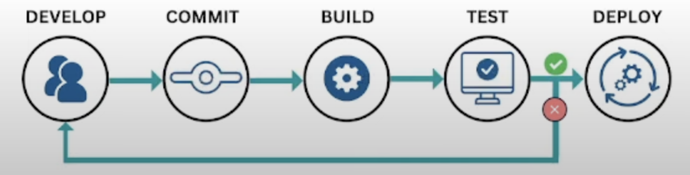
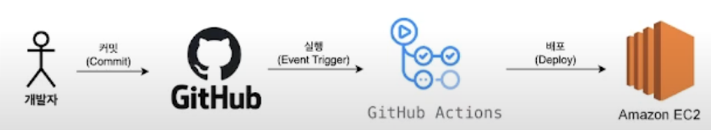
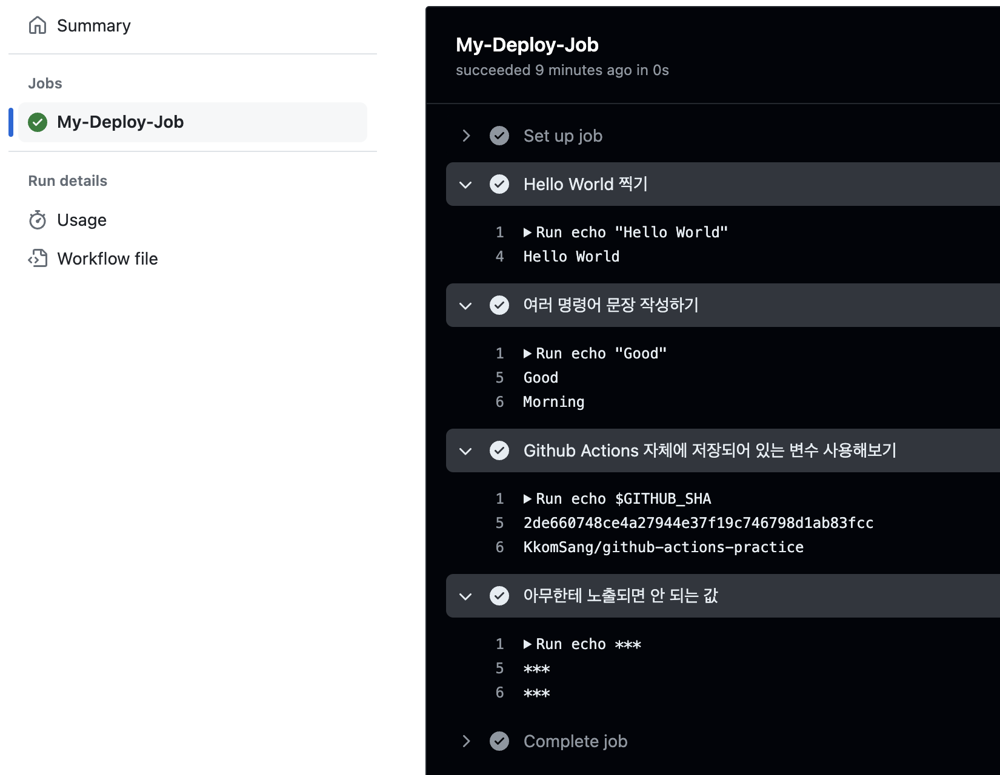
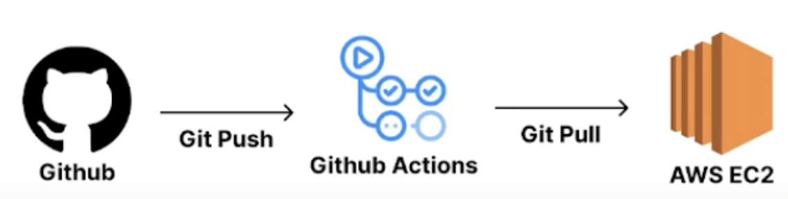

# CI/CD & Github Actions
- CI: 지속적 통합
    - 개발자를 위한 자동화 프로세스
    - 과정 : 개발자가 코드를 원격 저장소에 push(code 단계) → 원격 저장소로부터 코드를 가져와 테스트 후 빌드(Build 단계) → 코드 빌드 결과물이 다른 컴포넌트와 잘 통합되는지 확인(Test 단계)
- CD: 지속적 서비스 제공/배포
    - 과정 : 배포 가능한 소프트웨어 패키지를 작성(Release 단계) → 서비스를 사용자에게 배포(Deploy 단계) → 서비스 현황을 파악학고 문제를 감지(Operate 단계)
    
    ⇒ CI/CD는 테스트(Test), 통합(Merge), 배포(Deploy)의 과정을 자동화하는 것! 새로운 기능을 추가하며 코드가 변경될 때마다 새로운 코드를 다운받는(pull) 과정을 생략할 수 있음
    
- CI/CD 파이프라인
    - 배포 과정을 자동화 시키는 방법
    - 개발자가 코드를 작성해서 원격 저장소에 올림 →그 코드가 빌드, 테스트, 릴리즈를 거쳐 배포 서버로 전달 → 배포 서버에 도달한 빌드된 코드는 애플리케이션 서버로 최종 배포 → 유저가 결과물 확인
    1. Source 단계: 원격 저장소의 소스 코드에 변경 사항이 일어날 경우, 이를 감지하고 다음 단계로 전달
    2. Build 단계: Source 단계에서 전달받은 코드를 컴파일, 빌드, 테스트하여 가공. Build 단계를 거쳐 생성된 결과물을 다음 단계로 전달하는 작업을 수행.
    3. Deploy 단계: Deploy 단계에서는 Build 단계로부터 전달받은 결과물을 실제 서비스에 반영하는 작업.


출처 : https://www.youtube.com/watch?v=AuS2q56f7Ps&list=PLtUgHNmvcs6pzeVotjaBaRy-BtoWo_qBd&index=2 

- 무중단 배포 : 새로운 서비스를 릴리즈할 때 서버중단없이 배포하는 것
    - <Blue/Green 배포>
        - Blue: 현재 운영중인 서비스
        - Green: 새롭게 배포할 환경
        - Blue에서 서비스 가동 중일 때 Green에 새로운 버전을 배포하고, 배포가 완료되면 로드 밸런서가 Green으로 트래픽을 전환하고, Blue 서비스는 종료.
    - <Rolling 배포>
        - 새로운 버전을 점진적으로 적용하는 방식
        - 새로운 버전이 등록 되는 서버에서는 다운타임이 발생 할 수 있으므로 로드 밸런서가 일시적으로 트래픽을 보내지 않다가 배포가 완료된 후 다시 트래픽을 보내는 방식을 통해 새로운 버전을 배포 하는 전략
    - <Canary 배포>
        - 이전 버전과 새로운 버전이 동시에 가동되는 방식
        - 새 버전의 인스턴스는 일부 사용자에게만 서비스되고 나머지 사용자는 기존 버전을 사용.
- CI/CD 툴
    - **Github Actions**
    - Jenkins
    - Circle CI
    - Travis CI
- Github Actions를 활용한 전제적인 CI/CD 흐름
    - Github Actions : 로직을 실행시킬 수 있는 일종의 컴퓨터, CI/CD 과정에서 빌드, 테스트, 배포에 대한 로직을 실행!
        
        
        
        출처 : https://www.youtube.com/watch?v=DZJsVVoPGuo&list=PLtUgHNmvcs6pzeVotjaBaRy-BtoWo_qBd&index=4 
        
        1. 코드 작성 후 commit
        2. github에 push
        3. push를 감지해서 Github Actions에 작성한 로직 실행
            1. 빌드
            2. 테스트
            3. 배포
        4. 서버에서 배포된 최신 코드로 서버 재실행
- Github Actions 사용해보기
    - 프로젝트 최상단에 .github 폴더생성 (이름 지키기)
    - .github/workflows 폴더생성 (이름 지키기)
    - workflows/deploy.yml (이름 자유)
    
    ```yaml
    # workflow 이름
    name: Github Actions 실행시켜보기
    
    # Event(github actions를 실행시킬 시점) 설정
    # main 브랜치에 push 될 때 아래 workflow를 실행
    on:
      push:
        branches:
          - main
    
    # 하나의 workflow는 1개 이상의 job으로 구성됨
    # 여러 job은 기본적으로 병렬적으로 수행됨
    jobs:
    
      # job을 식별하기 위한 id
      My-Deploy-Job:
        # 가장 최신 버전의 ubuntu 환경 선택
        runs-on: ubuntu-latest
    
        # step:특정 작업을 수행하는 가장 작은 단위
        # job은 여러 stpe들로 구성됨
        steps:
          - name: Hello World 찍기
            run: echo "Hello World"
    
          - name: 여러 명령어 문장 작성하기
            run: |
              echo "Good"
              echo "Morning"

          - name: Github Actions 자체에 저장되어 있는 변수 사용해보기
            run: |
              echo $GITHUB_SHA
              echo $GITHUB_REPOSITORY
    
          - name: 아무한테 노출되면 안 되는 값
            # 깃허브 레포지토리 Settings/Security/Secrets and Variables/Actions에 환경변수 추가
            run: |
              echo ${{secrets.MY_NAME}}
              echo ${{secrets.MY_HOBBY}}
    
    # 들여쓰기가 매우 중요함!
    ```
    
	
    ### 전체적인 흐름
    



출처 : https://www.youtube.com/watch?v=2cgs9NR3ijo&list=PLtUgHNmvcs6pzeVotjaBaRy-BtoWo_qBd&index=6