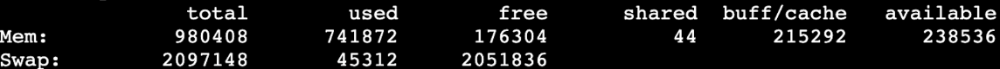
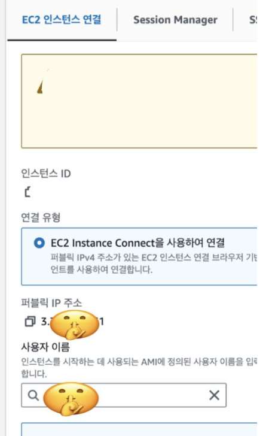
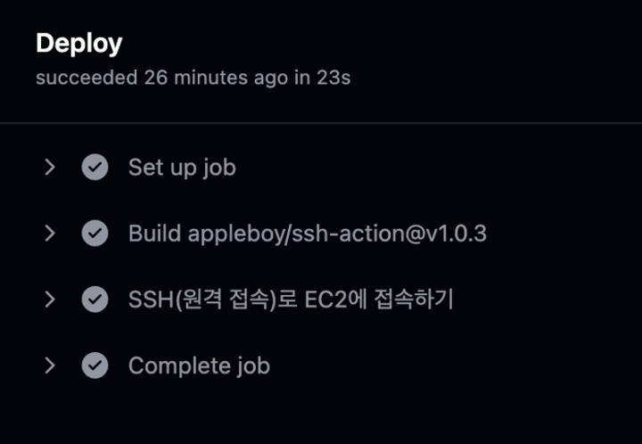

# CICD 실습
**개인프로젝트에서 많이 사용하는 방식**

### [프로젝트 및 EC2 생성]

- 프로젝트 생성 후 깃허브에 업로드
- EC2 생성(보안 그룹에 8080포트 열어주기)
- t2.micro 사용시 swap 메모리 할당 해주기
    
    ```
    $ sudo dd if=/dev/zero of=/swapfile bs=64M count=32
    $ sudo chmod 600 /swapfile
    $ sudo mkswap /swapfile
    $ sudo swapon /swapfile
    $ sudo swapon -s
    $ sudo vi /etc/fstab
    # 마지막 줄에 /swapfile swap swap defaults 0 0 추가
    ```
    
    $ free 명령어로 메모리 확인 가능!
    
    
    

### [CI/CD 없이 배포하는 방법]

EC2 접속

1. sudo update
2. sudo apt install openjdk-17-jdk -y
3. java -version
4. git clone (주소)
5. cd (클로해온 프로젝트)
6. ./gradlew clean build
    
    ⇒ build라는 폴더에 빌드된 파일이 생성됨
    
7. cd build
8. cd libs
    
    ⇒ (프로젝트명)-0.0.1-SNAPSHOT.jar 파일이 있음
    
    ⇒ plain.jar 아님!
    
9. nohup java -jar (프로젝트명)-0.0.1-SNAPSHOT.jar &
    
    ⇒ 파일 실행
    
10. sudo lsof -i:8080
    
    ⇒ 잘 실행되고 있는지 확인
    

---

**만약 파일 수정 & push 했다면**

1. 프로젝트 경로로 이동
2. git pull origin (브랜치명)
3. sudo fuser -k -n tcp 8080
    
     ⇒ tcp 8080포트에서 실행중인 프로세스를 종료시킴
    
4. ./gradlew clean build 
    
    ⇒ 다시 빌드
    
5. 앞의 7번~10번 다시 반복

이렇게 CI/CD를 구축하지 않으면 파일 수정 시 매번 동일한 과정을 반복해야 함! 매우 귀찮음!

---

**[git username & password 저장해두기]**

 ⇒ CICD 구축을 위해 필요한 과정!

private repository라면 pull 받을 때마다 Username과 Password(토큰)을 입력해줘야 함. 매번 입력하지 말고 저장해두자!

프로젝트 파일 위치에서

```
$ git config --global credential.helper store
```

이후 Username, Password 입력하면  그 뒤론 저장된 값을 사용!

다만 이 방식은 최상위 폴더의 .git-credential 파일에 들어가면 Username과 Password(토큰) 정보를 확인할 수 있어서 보안상 단점이 존재

---

### **[CI/CD를 구축해보자!]**

**[개인 프로젝트에 많이 사용되는 방식]**

1. 프로젝트 최상단에 **.github** 이라는 폴더 생성 (이름 지키기)
2. .github 아래에 **workflows** 라는 폴더 생성 (이름 지키기)
3. workflows 아래 deploy.**yml** 생성

```
name: Deploy To EC2

on:
  push:
    branches:
      - main

jobs:
  Deploy:
    runs-on: ubuntu-latest
    steps:
      - name: SSH(원격 접속)로 EC2에 접속하기
        uses: appleboy/ssh-action@v1.0.3
        with:
          host: ${{ secrets.EC2_HOST }}
          username: ${{ secrets.EC2_USERNAME }}
          key: ${{ secrets.EC2_PRIVATE_KEY }}
          script_stop: true
          script: |
            cd /home/ubuntu/(프로젝트명)
            git pull origin main
            ./gradlew clean build
            sudo fuser -k -n tcp 8080 || true
            nohup java -jar build/libs/*SNAPSHOT.jar > ./output.log 2>&1 &
```

**깃허브 repository Settings에 환경변수 저장하기!**



EC2_HOST: 퍼블릭 IP 주소

EC2_USERNAME: 사용자 이름

EC2_PRIVATE_KEY: cat (키페어이름).pem 마지막 %빼고 -부터-까지 복붙

이렇게 CI/CD를 세팅하면 main 브랜치에 push할 시 자동으로 새롭게 배포가 된다!



---

**[application.yml 파일 관리 방법]**

application.yml에 민감한 값을 저장하고 사용하기에 보안을 위해 보통 .gitignore에 application.yml을 추가해둠

cf) git rm -r —cached . ⇒ 캐시 리프레시

다만 이러면 git pull 할 때 application.yml 파일을 직접 옮겨서 작성해줘야함 ! → 수동.. 귀찮다…

```
name: Deploy To EC2

on:
  push:
    branches:
      - main

jobs:
  Deploy:
    runs-on: ubuntu-latest
    steps:
      - name: SSH(원격 접속)로 EC2에 접속하기
        uses: appleboy/ssh-action@v1.0.3
        env:
          APPLICATION_PROPERTIES: ${{ secrets.APPLICATION_PROPERTIES }}
        with:
          host: ${{ secrets.EC2_HOST }}
          username: ${{ secrets.EC2_USERNAME }}
          key: ${{ secrets.EC2_PRIVATE_KEY }}
          envs: APPLICATION_PROPERTIES
          script_stop: true
          script: |
            cd /home/ubuntu/(프로젝트명)
            git pull origin main
            mkdir -p src/main/resources
            echo "$APPLICATION_PROPERTIES" > src/main/resources/application.yml
            ./gradlew clean build
            sudo fuser -k -n tcp 8080 || true
            nohup java -jar build/libs/*SNAPSHOT.jar > ./output.log 2>&1 &
```

application.yml 파일 내용 전체 환경변수 APPLICATION_PROPERTIES에 저장

application.yml이 수정될 때마다 새로 저장해줘야 한다.

이 방식을 이용하면 깃허브에는 application.yml 파일이 올라가지 않고, EC2에서는 application.yml이 저장된다!

---

**[위 방식의 장점 & 단점]**

주로 **개인 프로젝트**에 사용하는 방식이다.

- 장점
    - git pull로 변경된 부분에 대해서만 업데이트 하므로 속도가 빠름
        - 대부분의 CI/CD는 전체 프로젝트를 통째로 갈아끼우는 방식
    - Github Actions만 사용하기 때문에 구조 간단
- 단점
    - 빌드 작업을 EC2에서 직접 진행하므로 서버 성능에 영향
    - Github 계정 정보(Username, Password(token))가 EC2에 저장되므로 가급적 개인 프로젝트에서만 사용할 것